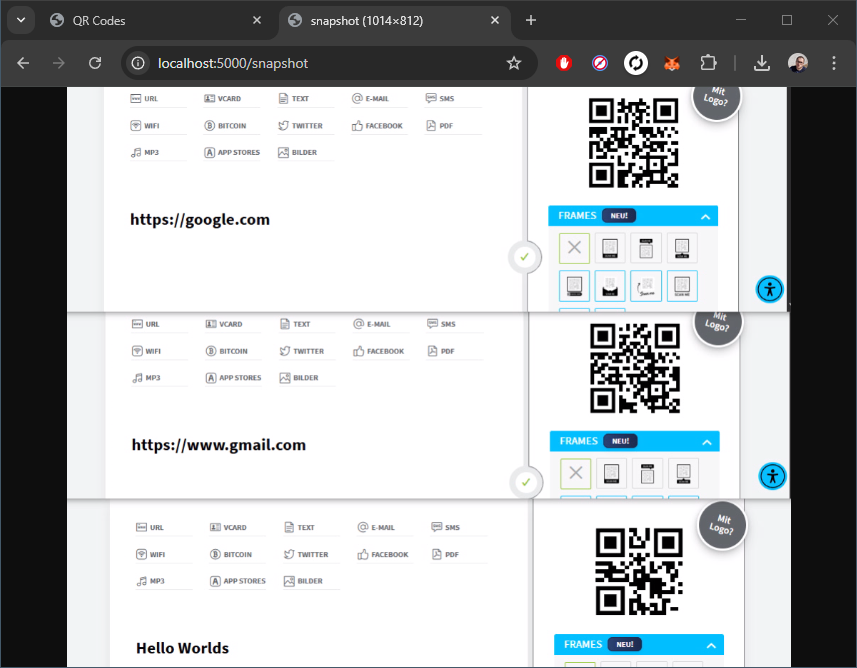
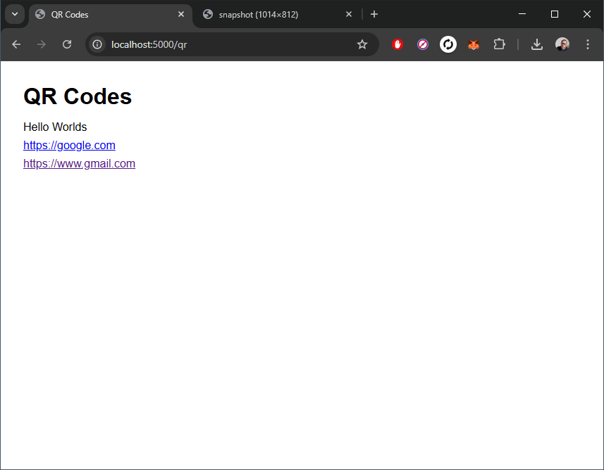

## Introduction
_NDeye_ is a small .NET executable that is able to capture frames from an NDI&trade; source on the Network.
Additionally, NDeye can find and decode QR codes on the captured frames.
Both, the image and any found qr contents will be provided to the user as HTTP entpoints.
## Endpoints
### /snapshot
Returns the image as PNG.
With an optional query parameter `?download=true`, a direct download of the image can be requested
### /qr
Found QR code contents in a given timeframe (default = 1 min) are displayed (links are clickable).
- Parameter `?redirect=true`: The user agent is redirected to the first found link if any
- Parameter `?timestamps=true`, the last-seen timestamp is displayed behind the contents

## Configuration
The NDI&trade; source name can be passed in appsettings.json, or alternatively as environment variable `Ndi__SourceName`.
Make sure to give a source name like: `MachineName (SourceName)`. (This is an NDI&trade; convention.)

## Screenshots (of user agent)
Streaming content with two QR codes and viewing them in http://localhost:5000/snapshot:

List of QR code contents during last 5 minutes:
